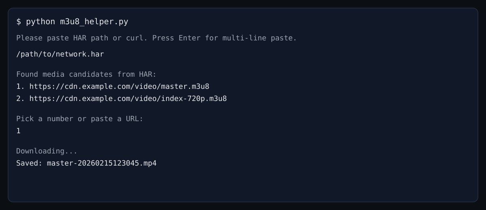
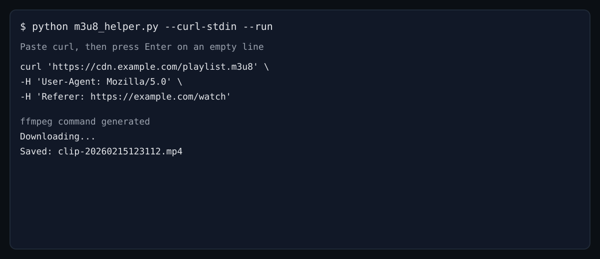

# M3U8 Helper

M3U8 下載輔助工具，用來掃描頁面中的 `.m3u8` 連結並產生 `ffmpeg` 指令。

注意：僅限你有合法下載權限的內容。本工具不協助繞過 DRM/付費牆/反爬機制。

## 專案結構

```
.
├─ src/
│  └─ m3u8_helper/
│     ├─ __init__.py
│     ├─ __main__.py
│     ├─ cli.py
│     ├─ core.py
│     ├─ curl_parser.py
│     └─ har_parser.py
├─ tests/
│  ├─ test_core.py
│  ├─ test_curl_parser.py
│  └─ test_har_parser.py
├─ m3u8_helper.py
├─ pyproject.toml
├─ requirements.txt
├─ requirements-dev.txt
├─ README.md
├─ CHANGELOG.md
├─ CONTRIBUTING.md
├─ SECURITY.md
├─ LICENSE
├─ .editorconfig
└─ .gitignore
```

## 安裝（獨立虛擬環境）

```bash
python3 -m venv .venv
source .venv/bin/activate
pip install -r requirements.txt
```

## 快速開始

1. 啟動互動模式：
```bash
python m3u8_helper.py
```
2. 貼上 HAR 檔案路徑或 curl（按空行結束）。
3. 選擇候選連結後自動下載。

## 使用方式

### 1. 已知 m3u8 連結

```bash
python m3u8_helper.py \
  --m3u8-url "https://media.example.com/playlist.m3u8" \
  --referer "https://media.example.com/watch" \
  --output "video.mp4"
```

### 2. 掃描頁面

```bash
python m3u8_helper.py \
  --page-url "https://example.com/video-page" \
  --referer "https://example.com/video-page"
```

### 2-1. 互動模式（直接貼 HAR 或 curl）

```bash
python m3u8_helper.py
```

### 3. 直接下載（執行 ffmpeg）

```bash
python m3u8_helper.py \
  --m3u8-url "https://media.example.com/playlist.m3u8" \
  --referer "https://media.example.com/watch" \
  --run
```

### 3-1. 自動加時間戳避免覆蓋（預設開啟）

預設會自動在檔名加入 yyyyMMddHHmmss，若要關閉請加上：

```bash
python m3u8_helper.py --curl-stdin --run --no-timestamp
```

### 3-2. 以頁面標題當檔名

會使用 `--page-url` 或 `Referer` 的頁面標題作為檔名（仍會加上時間戳）：

```bash
python m3u8_helper.py --curl-stdin --run --name-from-title
```

### 4. 自訂 Header

```bash
python m3u8_helper.py \
  --m3u8-url "https://media.example.com/playlist.m3u8" \
  -H "User-Agent: Mozilla/5.0" \
  -H "Referer: https://media.example.com/watch" \
  -H "Cookie: session=your_session_cookie"
```

### 5. 直接貼上 curl 指令（一鍵解析）

```bash
python m3u8_helper.py --curl "curl 'https://example.com/playlist.m3u8' -H 'User-Agent: UA' -H 'Referer: https://example.com/watch'"
```

或從檔案讀取：

```bash
python m3u8_helper.py --curl-file /path/to/curl.txt
```

說明：
- `--curl/--curl-file/--curl-stdin` 會自動解析 URL 與 headers
- 若同時提供 `--m3u8-url` 或 `--page-url`，會以你明確指定的為準

### 6. 直接貼上 curl 後自動下載

你可以直接貼 curl，多行也沒問題，完成後按空行或 Ctrl+D：

```bash
python m3u8_helper.py --curl-stdin --run
```

或用管線（macOS 可搭配 `pbpaste`）：

```bash
pbpaste | python m3u8_helper.py --curl-stdin --run
```

也可以直接從剪貼簿讀取（macOS）：

```bash
python m3u8_helper.py --clipboard --run
```

補充：若 curl 的 URL 不是 `.m3u8`，工具會直接下載該檔案（例如圖片、影片或其他檔案）。

### 7. 直接執行（預設互動模式）

不帶參數直接執行時，會進入互動模式，可直接貼 HAR 檔案路徑或 curl，貼完即自動下載：

```bash
python m3u8_helper.py
```

### 8. 檢查連結與 Debug Headers

先檢查 m3u8 是否可存取（會用相同 headers）：

```bash
python m3u8_helper.py --curl-stdin --check
```

列出實際送出的 headers：

```bash
python m3u8_helper.py --curl-stdin --debug-headers
```

### 9. 從 HAR 檔案解析（抓 blob 背後的真實資源）

1. 瀏覽器開啟開發者工具（Network），勾選 Preserve log
2. 重新整理並播放影片
3. 右鍵列表 → Save all as HAR with content

若解析不到媒體連結，通常是因為未播放影片或未以「Save all as HAR with content」匯出。

使用方式：

```bash
python m3u8_helper.py --har-file /path/to/network.har --run
```

## 截圖（示意）

互動模式（HAR 或 curl）：


多行 curl 下載：


## 常見問題

1. 遇到 403？
通常代表 URL 需要有效授權或短效簽名，請以「瀏覽器成功播放當下」匯出 HAR 或複製 cURL。

2. 檔名會被覆蓋嗎？
預設會在檔名加入時間戳，避免覆蓋。若要關閉請加 `--no-timestamp`。

3. 為什麼找不到影片？
HTML 可能只嵌入 iframe，請改用 HAR 匯出或 Network 面板尋找 `.m3u8/.mpd` 請求。

## 開發

```bash
pip install -r requirements-dev.txt
pytest
ruff check .
black .
```

## 直接執行
```bash
python3 -m venv .venv
source .venv/bin/activate
pip install -r requirements.txt
python m3u8_helper.py
```

## 授權

MIT 授權（可自行更換）。
